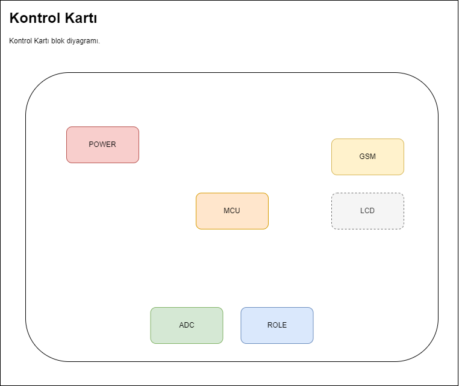

# Damla Sulama Sistemi Kontrol Kartı
Proje kapsamında, el ile kontrol edilen, bir dizel motor vasıtasıyla sisteme su basan, eski tip **_Damla Sulama Sistemi_** kısmen modernize edilerek arıza ve su kesilmelerinde sistemi durdurarak kullanıcıyı bilgilendirecek yetenekler eklenecektir.

Bitki sulama ve sulamanın otomatik başlatılması için gerekli ölçüm ve kontroller bu projenin kapsamı dışındadır. Bahsi geçen yetenekler sonraki versiyonlarda sisteme eklenebilir.

## Damla Sulama Sistemi
Damla sulama, toprak yüzeyine veya yüzeyin hemen altına yerleştirilen küçük çaplı orifis yardımıyla arıtılmış suyu toprak yüzeyine veya içerisine veren bir sistemdir. Bu sistem suyun belirlenmiş bir desene alçak basınç altında verilmesine imkan sağlar. Bu sistemde su yaygın boru ağı aracılığı ile her bitkiye kadar götürülür. Öte yandan bitkilere verilecek gübreler de sulama suyu ile birlikte verilebilir (fertigation). Kısaca sistemin esası bitkinin ihtiyaç duyduğu su ve besin maddesi miktarını optimum seviyede tutmaktır. Bu yöntem sera, meyve, sebze bahçelerinde en çok kullanılan ve ekonomik su kullanımı sağlayan bir yöntemdir.

Damla sulama sistemleri genellikle aşağıdaki parçalardan oluşur;

* Sisteme su sağlayan basınçlı bir tank
* Tankı doldurmak ve yeterli basıncı sağlamak için bir pompa
* Pompaya hareket sağlamak için bir motor
* Sisteme su sağlamak için bir su kaynağı (su deposu veya sulama kanalı)

## Damla Sulama Sistemlerinde Çozülmesi Amaçlanan Sorun
Bu tip sistemlerde çoğunlukla bir elektrik motoru tercih edilse de eski sistemlerde veya elektrik olmayan bölgelerde halen dizel motor tercih edilmektedir.

Bu tip sistemlerde su soğutmalı pompalar kullanılmaktadır ve pompanın susuz çalıştırılmaması gerekmektedir. Eğer sisteme su sağlayan kaynakta herhangi bir nedenle su olmazsa kısa bir süre sonra pompa aşırı ısınarak yanmaktadır.

Damla sulama sistemlerinde kullanılan basınçlı tankların giriş borusunda bir manometre bulunmaktadır. Kullanıcı bu manometre üzerinde sürekli olarak basınç değerini gözle kontrol etmekte ve basıncın aşırı yükseldiği veya aşırı düştüğü durumlarda sisteme müdahale etmektedir. Bu nedenle sulama yapıldığı süre boyunca bir kişinin sürekli sistemin başında nöbet tutması ve sistemi izlemesi gerekmektedir.

Bu proje tam olarak bu sorunu çözerek hem sistemin otomatik kontrolünü yapmayı ve böylece dikkat dağınıklığı ve ihmalden kaynaklanan hataları gidermeyi hem de bir sistemi izlemekle görevli kişi veya kişilerin başka işlerle uğraşabilmesi için tasarruf sağlanmasını amaçlamaktadır.  

## Kontrol Kartı
Projede problemin çözümü için sistem basıncını izleyen ve aşırı yüksek/aşırı düşük basınç durumlarında sistemi durdurarak kullanıcıyı SMS ile uyaran bir kontrol kartı tasarlanması uygun görülmüştür. Kontrol kartının aşağıdaki görevleri yerine getirmesi beklenmektedir.

* Basınç kontrolü için kullanılan manometrenin yerine veya manometreye ek bir basınç sensörü bağlanarak sistemin basıncı sürekli kontrol edilecektir.
* Farklı marka ve model sistemlerde normal çalışma basınç değeri değişiklik gösterebileceğinden dolayı minimum ve maksimum basınç değerlerinin kullanıcı tarafından belirlenmesi mümkün olmalıdır.
* Sistem basıncı her zaman sabit olmaya bilmektedir. Kısa süreliğine artıp azalarak bir dalgalanma olması normal kabul edilmektedir. Eğer basınç değeri normal aralık dışına çıkarsa, ne kadar süre için bu durumun normal kabul edilmesi gerektiği kullanıcı tarafından belirlenebilmelidir.
* Sistem basıncı normal aralık dışına çıktıktan sonra, kullanıcı tarafından belirlenen süreden daha fazla bu değerlerde kalıyorsa sistemin çalışmasının durdurulması gerekmektedir.
* Sistem herhangi bir nedenle durdurulursa SMS ile kullanıcının bilgilendirilmesi gerekmektedir. Böylece kullanıcı zaman kaybetmeden sorunu gidererek sulamayı tekrar başlatabilir.
* Sistemin SMS yollayacağı telefon numarası kullanıcı tarafından belirlenebilmelidir.
* İlk çalıştırma ve kullanıcının normal çalışma değerleri dışına çıkacak bilinçli olarak yapacağı ayarlar, kontrol kartı tarafından hata durumu olarak algılanacak ve sistemi kapatmaya çalışacaktır. Bu nedenle kartın devre dışı bırakılabilmesi gerekmektedir.

### Kontrol Kartı Blok Diyagramı
Kontrol kartının modüllerini ve yeteneklerini gösteren blok diyagram aşağıdaki gibidir.

